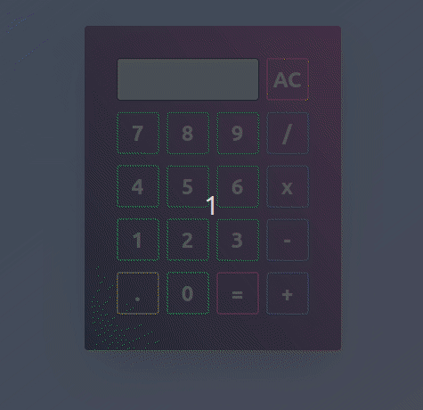

## Calculator

A responsive, functional calculator built with **vanilla JavaScript**, **HTML**, and **TailwindCSS**. This project helped me solidify core JavaScript concepts like DOM manipulation, event handling, and simple state management—all while building something practical and clean.




Features

- Basic arithmetic: addition, subtraction, multiplication, division
- Clear / reset functionality
- Keyboard-friendly layout (clickable buttons)
- Mobile-responsive layout using Tailwind
- Clean UI styled with Tailwind CDN

---

Tech Stack

- HTML
- TailwindCSS (via CDN)
- JavaScript (vanilla)

---

## Installation & Usage

To view the calculator in your browser:

```bash
git clone https://github.com/Ajbakaric/Calculator.git
cd Calculator
```

### Run using Live Server:
Use [Live Server](https://marketplace.visualstudio.com/items?itemName=ritwickdey.LiveServer) in VS Code.

>  If Live Server doesn't auto-launch, manually open:
> `http://127.0.0.1:5500/index.html`

### Or:  
Double-click `index.html` to open it directly in your browser.

---


## Folder Structure

```
Calculator/
├── index.html
├── main.js
├── addStyles.js
├── styles.css
├── demo.gif
└── README.md
```

---

##  Acknowledgments

Thanks to [The Odin Project](https://www.theodinproject.com/) for the roadmap and project ideas. This was one of my foundational JavaScript builds.

